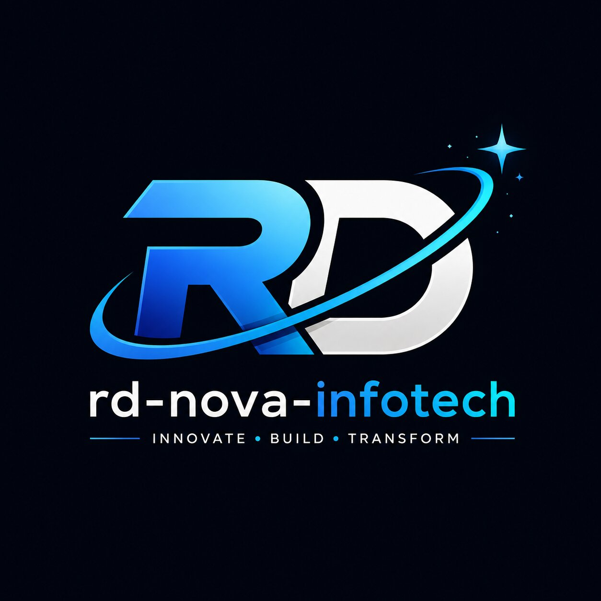

  

<h1 align="center">🚀 RD Nova Infotech</h1>

  <b>Design • Develop • Test • Automate • Innovate</b>

Building modern software products, enterprise solutions, quality engineering, and AI-powered applications.

---

# 🌟 About Us

**RD Nova Infotech** is a technology company dedicated to designing, developing, testing, and delivering high-quality software solutions.

We believe great software is built through strong engineering, rigorous quality assurance, continuous innovation, and collaboration.

Our expertise spans software development, e-commerce solutions, quality engineering, automation, DevOps, cloud technologies, artificial intelligence, and open-source software.

---

# 💻 Technology Stack

## 🖥️ Software Development

- ☕ Java
- 🌱 Spring Boot
- ⚛️ React
- 🟨 JavaScript
- 🌐 HTML5
- 🎨 CSS3
- 🗄️ MySQL
- 🐘 PostgreSQL
- 🔗 REST APIs
- 📦 Maven
- 🧩 Microservices

---

## 🧪 Quality Engineering & Test Automation

- ✅ Manual Testing
- 🧪 Selenium
- 🎭 Playwright
- 🔗 REST Assured
- 📱 Appium
- 📮 Postman
- 📋 TestNG
- ⚡ JUnit
- 🚀 Performance Testing
- 🔍 API Testing

---

## ☁️ DevOps & Cloud

- 🐙 Git & GitHub
- 🐳 Docker
- 🔄 GitHub Actions
- 🚀 CI/CD
- ☁️ AWS
- 🐧 Linux

---

## 🤖 AI & Innovation

- 🤖 Artificial Intelligence
- 🧠 Machine Learning
- 💬 Large Language Models (LLMs)
- ⚙️ Automation Tools
- 🌍 Open Source Technologies

---

# 🚀 What We Build

# 🚀 What We Build

- 💻 Custom Software Applications
- 🌐 Web Applications
- 📱 Mobile Applications
- 🏢 Enterprise Solutions

---

# 📌 Featured Repositories

> Coming Soon

- ☕ Java Fundamentals
- 🌱 Spring Boot Projects
- 🛒 E-Commerce Platform
- 🧪 Selenium Automation Framework
- 🎭 Playwright Automation Framework
- 🔗 REST Assured Framework
- 🤖 AI Utilities
- 📚 Technical Documentation

---

# 🎯 Our Vision

To become a trusted technology company by delivering innovative software products, world-class quality engineering, and intelligent automation solutions.

---

# 🤝 Contributing

We welcome developers, QA engineers, designers, and technology enthusiasts.

Feel free to:

- ⭐ Star our repositories
- 🐞 Report issues
- 🚀 Submit pull requests
- 💡 Share ideas and improvements

---

# 📫 Connect With Us

🌐 Website: **Coming Soon**

💼 LinkedIn: **Coming Soon**

📧 Business Email: **Coming Soon**

---

## ⭐ Building the Future Through Development, Quality & Innovation ⭐

